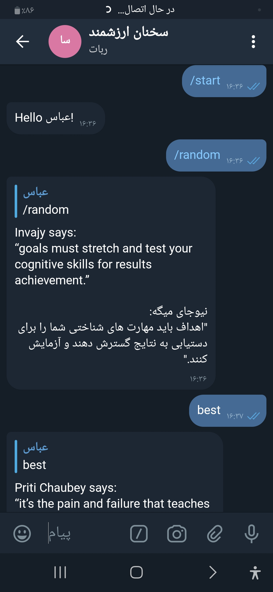

## Python Motto-Quote-Bot via telegram
A Telegram Bot for inspirational-quotes, written in \`Python\`, and inspired by \`cowsay\`

---
## ربات تلگرامی سخنان بزگان
این یک ربات تلگرامی است که با پایتون نوشته، و از \`cowsay\` الهام گرفته شده.
همراه با ترجمه فارسی در قالبی مناسب.


<sub>بک-اند ترجمه از <a href="https://github.com/ismalzikri/free-translate-api"><strong>از این ریپو</strong></a> کمک گرفته شده</sub>

---
### How to run
clone the repo
``` bash
git clone https://github.com/AbbasDehganzadeh/py-notto-bot.git
cd py-notto-bot/
```
first specify given variables in sample `.env` file.

then start the translate api
``` bash
cd free-translate-ali && go run main.go
```

finally create a venv, and run your app

``` bash
python3 -m virtualenv .venv
source .venv/bin/activate
python3 main.py
```

---
### دستور های موجود
* /start: شروع برنامه و خوش آمد گویی به کاربر
* /help: طرز استفاده از ربات.
* /random: یک نقل قول تصادفی.
* 'kword': یک نقل قول تصادفی حاوی کلمه مورد نظر.

امیدوارم لذت ببرید;)
